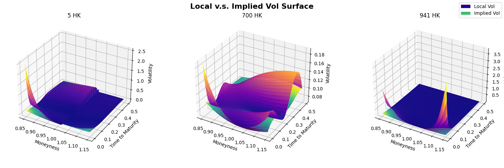

# Equity Linked Note Pricer

## 1. Yield And Dividend Curves

### Yield Curve

We collected HIBOR Rate (11/24/2023) under different maturity as risk free rate. The source data is:

|   1D    |   1W    |   15D   |   1M    |   2M    |   3M    |   6M    |   1Y    |
| :-----: | :-----: | :-----: | :-----: | :-----: | :-----: | :-----: | :-----: |
| 5.07048 | 5.28202 | 5.28649 | 5.37941 | 5.58012 | 5.64167 | 5.61137 | 5.58054 |

Then we use the **Cubic Spline** method to interpolate between discreet points:

```python
def yield_curve_interpolate() -> np.array:
    basic_curve = [i / 100 for i in [5.07048, 5.28202, 5.28649, 5.37941,
																		 5.58012, 5.64167, 5.61137, 5.58054]]
    basic_time = [1 / 252, 5 / 252, 15 / 252, 1 / 12, 2 / 12, 3 / 12, 6 / 12, 1]
    cs = CubicSpline(basic_time, basic_curve)
    ts = np.arange(0, 1, 1 / 252)
    return np.array(cs(ts))
```


### Forward Rate Curve

In order to simulate stock trajectories, we need to know 1-Day forward rate at each time point. They are calculated as follows: $r_{t, t+1} = \frac{Y_{t+1}\cdot(t+\Delta t) - Y_t\cdot t}{\Delta t}$, With Python implementation:

```python
def forward_rate_curve(yield_curve: np.array) -> np.array:
    dt = 1 / 252
    ts = np.arange(0, 1, 1 / 252)
    forward_rate_curve = np.zeros(len(ts))
    for i in range(len(ts) - 1):
        forward_rate_curve[i] = (yield_curve[i+1]*ts[i+1]-yield_curve[i]*ts[i])/dt
    return np.array(forward_rate_curve)

```


### Dividend Curves

We calculate dividend curves such that we only discount the stock price at the exercise date. The effective dividend yield at the exercise date $t$: $q(t)=-252\cdot\log(1-\frac{D}{S_0e^{rt}})$, With Python implementation:

```python
def dividend_yield_curve(stock_code: Literal["700 HK", "5 HK", "941 HK"]) -> np.array:
    match stock_code:
        case "700 HK":
            S0 = 321.2
            dividend = 2.256
            day = 73
        case "5 HK":
            S0 = 59.45
            dividend = 0.318
            day = 104
        case "941 HK":
            S0 = 63.35
            dividend = 2.53
            day = 151
    discount_rate = yield_curve_interpolate()[day]
    dividend_yield = np.zeros(252)
    dividend_yield[day] = 252 * np.log(1 - dividend * np.exp(-discount_rate * day / 252) / S0)
    return np.array(dividend_yield)
```

Corresponding dividend curve plots for different stocks:


## 2. Volatility Surfaces

### Raw Data

We collected the Nov, Dec, Jan, Feb, Mar, and Jun option prices of each stocks with 25 strikes centered around the spot price from Bloomberg. The data is reshaped and saved in Excel file named `option_chains.xlsx`.

### Implied Volatility Surface

#### Step 1: Numerically Solve Black-Scholes Implied Volatility

1. Define the Black-Scholes implied total variance $w$ by: $w = \sigma^2_{BS} \cdot T$
2. Define the forward log-moneyness $y$ by: $y = \log(\frac{K}{F_T})$
3. Therefore, the Black-Scholes formula for vanilla European options becomes: $C = F_T[N(d_1)-e^yN(d_2)], \qquad P = F_T[e^yN(-d_2) - N(-d_1)]$, where $d_1 = -\frac{y}{\sqrt{w}} + \frac{\sqrt{w}}{2}, \qquad d_2 = d_1-\sqrt{w}$
4. Finally we acquire the Black-Scholes implied volatility by solving the equation $C_{BS}(\sigma^2_{BS})=price$ or $P_{BS}(\sigma^2_{BS})=price$ (from the market) depending on the sign of forward log-moneyness using Newton-Raphson method.

#### Step 2: Regression Volatility Against Forward Log-moneyness

1. After calculating desecrate volatility points, we fit the curve of different forward log-moneyness $y$ at the same maturity $T$ by the model: $\sigma^2_{y} = \sigma^2_{atm} + \delta\big(\frac{\tanh(\kappa y)}{\kappa}\big) + \frac{\gamma}{2}\big(\frac{\tanh(\kappa y)}{\kappa}\big)^2 + \epsilon$
2. We calibrate the parameters by minimising the objective function: $RSS = \sum(\sigma^2_{y} - \hat{\sigma_{y}^2})^2$, with Python implementation:

```python
def calc_implied_vol_curve(stock_code: Literal["700 HK", "5 HK", "941 HK"], day: int, log_moneyness: float | np.ndarray):
    # Read option data from excel
    option_chains = pd.read_excel("data/option_chains.xlsx", index_col=False)
    option_chains = option_chains[(option_chains["stock_code"] == stock_code) & (option_chains["biz_days_to_maturity"] == day)]
    # Calculate basic parameters
    S0 = option_chains["spot_price"].iloc[0]
    yc = yield_curve_interpolate()
    fc = forward_rate_curve(yc)
    dc = dividend_yield_curve(stock_code)
    r = fc[:day]
    q = dc[:day]
    #  Store log moneyness-implied vol pairs in data
    data = []
    for _, row in option_chains.iterrows():
        F = S0 * exp(sum(r - q) / 252)
        y = log(row["strike"] / F)
        if y >= 0:
            isCall = True
            price = row["call_price"]
        else:
            isCall = False
            price = row["put_price"]
        if price != 0:
            w = calc_implied_total_vol(price, isCall, F, y)
            data.append((y, w / (day / 252)))
    data = np.array(data)
    # Fitting contentious implied vol curve
    def fitting_function(parameters, x):
        sig2_0, delta, kappa, gamma = parameters
        return sig2_0 + delta * np.tanh(kappa * x) / kappa + gamma / 2 * (np.tanh(kappa * x) / kappa) ** 2
    def calc_rss(parameters):
        return sum((data[:, 1] - fitting_function(parameters, data[:, 0])) ** 2)
    parameters = minimize(calc_rss, np.array([0.01, 0.5, 0.5, 0.5])).x
    return fitting_function(parameters, log_moneyness)
```

Sample fitting curves:


#### Step 3: Fitting Implied Volatility Surface

Finally we fit the Black-Scholes implied volatility surface across data from available maturities (23, 46, 67, 87, 153 days) using Cubic Spline. We also transform the input from forward log-moneyness ($y = \log(\frac{K}{F_T})$) to moneyness ($m = \frac{K}{S_0}$) by the following equation: $y = \log(m) - \int_0^T\big(r(t) - q(t)\big)dt$, With Python implementation:

````python
def calc_forward_implied_vol_surface(
    stock_code: Literal["700 HK", "5 HK", "941 HK"], moneyness: float | np.ndarray, T: float | np.ndarray
) -> float | np.ndarray:
    yc = yield_curve_interpolate()
    fc = forward_rate_curve(yc)
    dc = dividend_yield_curve(stock_code)
    day_list = [23, 46, 67, 87, 153]
    implied_vol_curve_list = []
    for day in day_list:
        r = fc[:day]
        q = dc[:day]
        log_forward_moneyness = np.log(moneyness) - sum(r - q) / 252
        implied_vol_curve_list.append(calc_implied_vol_curve(stock_code, day, log_forward_moneyness))
    cs = CubicSpline(np.array(day_list) / 252, implied_vol_curve_list)
    return cs(T)
    ```
````

Corresponding Black-Scholes implied volatility surface for different stocks:


### Local Volatility (Gatheral's Method)

#### Transformation From Black-Scholes Implied Volatility

For each point on the Black-Scholes implied volatility surface $w(y,T)=\sigma^2_{BS}T$, we can find the corresponding local volatility $v_L$ by the following transformation equation via:

$$v_L = \frac{\frac{\partial w}{\partial T}}{1-\frac{y}{w}\frac{\partial w}{\partial y}+\frac{1}{4}(-\frac{1}{4}-\frac{1}{w}+\frac{y^2}{w^2})(\frac{\partial w}{\partial y})^2+\frac{1}{2}\frac{\partial^2 w}{\partial y^2}}$$

Here we also transform the input moneyness $m$ to forward log-moneyness $y$ to fit the equation above. The partial derivatives $\frac{\partial w}{\partial y}$, $\frac{\partial^2 w}{\partial y^2}$, and $\frac{\partial w}{\partial T}$ are calculated via numerical differentiation method through Python packages.

Due to the fact that we fitted the Black-Scholes implied volatility surface with z-axis as $\sigma^2_{BS}$ before, we need to multiply the matrix of surface $\sigma^2_{BS}(y, T)_{(300 \times 126)}$ by $diag(T)_{(126 \times 126)}$ via:

$$
w(y, T) =
    \begin{bmatrix}
        T_{1} & & \\
        & \ddots & \\
        & & T_{126}
    \end{bmatrix}
    \cdot \sigma^2_{BS}(y, T) \text{, where }T_{i} = \frac{i}{252}
$$

With Python Code implementation:

```python
def local_vol_transform(stock_code: Literal["700 HK", "5 HK", "941 HK"], moneyness: float | np.ndarray, T: float | np.ndarray):
    yc = yield_curve_interpolate()
    fc = forward_rate_curve(yc)
    dc = dividend_yield_curve(stock_code)
    log_moneyness = np.log(moneyness)

    def partial_y(log_moneyness: float):
        return np.dot(np.diag(T), partial(calc_forward_implied_vol_surface, stock_code=stock_code, T=T, log=True)(moneyness=log_moneyness))

    def partial_t(T: float):
        return np.dot(np.diag(T), partial(calc_forward_implied_vol_surface, stock_code=stock_code, moneyness=log_moneyness, log=True)(T=T))

    dw_dy = derivative(partial_y, log_moneyness, dx=1e-5)
    d2w_dy2 = derivative(partial_y, log_moneyness, dx=1e-5, n=2)
    dw_dt = derivative(partial_t, T, dx=1 / 252)
    w = np.dot(np.diag(T), calc_forward_implied_vol_surface(stock_code, log_moneyness, T, log=True))
    log_forward_moneyness = np.array([np.log(moneyness) - sum(fc[: int(t * 252)] - dc[: int(t * 252)]) / 252 for t in T])
    local_vol = dw_dt / (
        1 - log_forward_moneyness / w * dw_dy + 1 / 4 * (-1 / 4 - 1 / w + log_forward_moneyness**2 / w**2) * dw_dy**2 + 1 / 2 * d2w_dy2
    )
    return local_vol
```

Plots for combining the local volatility surface with the Black-Scholes implied volatility surface:


