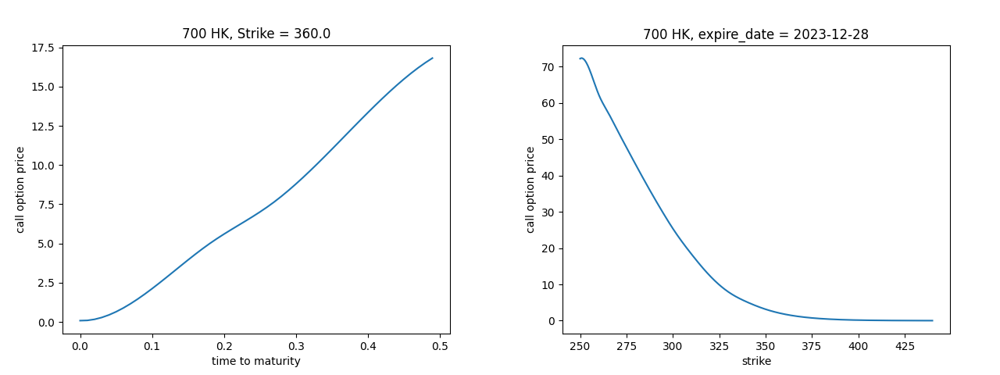

# Equity Linked Note Pricer

## 1. Yield And Dividend Curves

### Yield Curve

We collected HIBOR Rate (11/24/2023) under different maturity as risk free rate. The source data is:

|   1D    |   1W    |   15D   |   1M    |   2M    |   3M    |   6M    |   1Y    |
| :-----: | :-----: | :-----: | :-----: | :-----: | :-----: | :-----: | :-----: |
| 5.07048 | 5.28202 | 5.28649 | 5.37941 | 5.58012 | 5.64167 | 5.61137 | 5.58054 |

Then we use the **Cubic Spline** method to interpolate between discreet points:

```python
def yield_curve_interpolate() -> np.array:
    basic_curve = [i / 100 for i in [5.07048, 5.28202, 5.28649, 5.37941, 5.58012, 5.64167, 5.61137, 5.58054]]
    basic_time = [1 / 252, 5 / 252, 15 / 252, 1 / 12, 2 / 12, 3 / 12, 6 / 12, 1]
    cs = CubicSpline(basic_time, basic_curve)
    ts = np.arange(0, 1, 1 / 252)
    return np.array(cs(ts))
```

<p align="center">
  
</p>


### Forward Rate Curve

In order to simulate stock trajectories, we need to know 1-Day forward rate at each time point. They are calculated as follows: $r_{t, t+1} = \frac{Y_{t+1}\cdot(t+\Delta t) - Y_t\cdot t}{\Delta t}$, with Python implementation:

```python
def forward_rate_curve(yield_curve: np.array) -> np.array:
    dt = 1 / 252
    ts = np.arange(0, 1, 1 / 252)
    forward_rate_curve = np.zeros(len(ts))
    for i in range(len(ts) - 1):
        forward_rate_curve[i] = (yield_curve[i+1]*ts[i+1]-yield_curve[i]*ts[i])/dt
    return np.array(forward_rate_curve)

```


### Dividend Curves

We calculate dividend curves such that we only discount the stock price at the exercise date. The effective dividend yield at the exercise date $t$: $q(t)=-252\cdot\log(1-\frac{D}{S_0e^{rt}})$, With Python implementation:

```python
def dividend_yield_curve(stock_code: Literal["700 HK", "5 HK", "941 HK"]) -> np.array:
    match stock_code:
        case "700 HK":
            S0 = 321.2
            dividend = 2.256
            day = 73
        case "5 HK":
            S0 = 59.45
            dividend = 0.318
            day = 104
        case "941 HK":
            S0 = 63.35
            dividend = 2.53
            day = 151
    discount_rate = yield_curve_interpolate()[day]
    dividend_yield = np.zeros(252)
    dividend_yield[day] = 252 * np.log(1 - dividend * np.exp(-discount_rate * day / 252) / S0)
    return np.array(dividend_yield)
```

Corresponding dividend curve plots for different stocks:


## 2. Volatility Surfaces

### Raw Data

We collected the Nov, Dec, Jan, Feb, Mar, and Jun option prices of each stocks with 25 strikes centered around the spot price from Bloomberg. The data is reshaped and saved in Excel file named `option_chains.xlsx`.

### Implied Volatility Surface

#### Step 1: Numerically Solve Black-Scholes Implied Volatility

1. Define the Black-Scholes implied total variance $w$ by: $w = \sigma^2_{BS} \cdot T$
2. Define the forward log-moneyness $y$ by: $y = \log(\frac{K}{F_T})$
3. Therefore, the Black-Scholes formula for vanilla European options becomes: $C = F_T[N(d_1)-e^yN(d_2)], \qquad P = F_T[e^yN(-d_2) - N(-d_1)]$, where $d_1 = -\frac{y}{\sqrt{w}} + \frac{\sqrt{w}}{2}, \qquad d_2 = d_1-\sqrt{w}$
4. Finally we acquire the Black-Scholes implied volatility by solving the equation $C_{BS}(\sigma^2_{BS})=price$ or $P_{BS}(\sigma^2_{BS})=price$ (from the market) depending on the sign of forward log-moneyness using Newton-Raphson method.

#### Step 2: Regression Volatility Against Forward Log-moneyness

1. After calculating desecrate volatility points, we fit the curve of different forward log-moneyness $y$ at the same maturity $T$ by the model: $\sigma^2_{y} = \sigma^2_{atm} + \delta\big(\frac{\tanh(\kappa y)}{\kappa}\big) + \frac{\gamma}{2}\big(\frac{\tanh(\kappa y)}{\kappa}\big)^2 + \epsilon$
2. We calibrate the parameters by minimising the objective function: $RSS = \sum(\sigma^2_{y} - \hat{\sigma_{y}^2})^2$, with Python implementation:

```python
def calc_implied_vol_curve(stock_code: Literal["700 HK", "5 HK", "941 HK"], day: int, log_moneyness: float | np.ndarray):
    # Read option data from excel
    option_chains = pd.read_excel("data/option_chains.xlsx", index_col=False)
    option_chains = option_chains[(option_chains["stock_code"] == stock_code) & (option_chains["biz_days_to_maturity"] == day)]
    # Calculate basic parameters
    S0 = option_chains["spot_price"].iloc[0]
    yc = yield_curve_interpolate()
    fc = forward_rate_curve(yc)
    dc = dividend_yield_curve(stock_code)
    r = fc[:day]
    q = dc[:day]
    #  Store log moneyness-implied vol pairs in data
    data = []
    for _, row in option_chains.iterrows():
        F = S0 * exp(sum(r - q) / 252)
        y = log(row["strike"] / F)
        if y >= 0:
            isCall = True
            price = row["call_price"]
        else:
            isCall = False
            price = row["put_price"]
        if price != 0:
            w = calc_implied_total_vol(price, isCall, F, y)
            data.append((y, w / (day / 252)))
    data = np.array(data)
    # Fitting contentious implied vol curve
    def fitting_function(parameters, x):
        sig2_0, delta, kappa, gamma = parameters
        return sig2_0 + delta * np.tanh(kappa * x) / kappa + gamma / 2 * (np.tanh(kappa * x) / kappa) ** 2
    def calc_rss(parameters):
        return sum((data[:, 1] - fitting_function(parameters, data[:, 0])) ** 2)
    parameters = minimize(calc_rss, np.array([0.01, 0.5, 0.5, 0.5])).x
    return fitting_function(parameters, log_moneyness)
```

Sample fitting curves:


#### Step 3: Fitting Implied Volatility Surface

Finally we fit the Black-Scholes implied volatility surface across data from available maturities (23, 46, 67, 87, 153 days) using Cubic Spline. We also transform the input from forward log-moneyness ($y = \log(\frac{K}{F_T})$) to moneyness ($m = \frac{K}{S_0}$) by the following equation: $y = \log(m) - \int_0^T\big(r(t) - q(t)\big)dt$, With Python implementation:

````python
def calc_forward_implied_vol_surface(
    stock_code: Literal["700 HK", "5 HK", "941 HK"], moneyness: float | np.ndarray, T: float | np.ndarray
) -> float | np.ndarray:
    yc = yield_curve_interpolate()
    fc = forward_rate_curve(yc)
    dc = dividend_yield_curve(stock_code)
    day_list = [23, 46, 67, 87, 153]
    implied_vol_curve_list = []
    for day in day_list:
        r = fc[:day]
        q = dc[:day]
        log_forward_moneyness = np.log(moneyness) - sum(r - q) / 252
        implied_vol_curve_list.append(calc_implied_vol_curve(stock_code, day, log_forward_moneyness))
    cs = CubicSpline(np.array(day_list) / 252, implied_vol_curve_list)
    return cs(T)
    ```
````

Corresponding Black-Scholes implied volatility surface for different stocks:


### Local Volatility (Gatheral's Method)

#### Transformation From Black-Scholes Implied Volatility

For each point on the Black-Scholes implied volatility surface $w(y,T)=\sigma^2_{BS}T$, we can find the corresponding local volatility $v_L$ by the following transformation equation via:

$$v_L = \frac{\frac{\partial w}{\partial T}}{1-\frac{y}{w}\frac{\partial w}{\partial y}+\frac{1}{4}(-\frac{1}{4}-\frac{1}{w}+\frac{y^2}{w^2})(\frac{\partial w}{\partial y})^2+\frac{1}{2}\frac{\partial^2 w}{\partial y^2}}$$

Here we also transform the input moneyness $m$ to forward log-moneyness $y$ to fit the equation above. The partial derivatives $\frac{\partial w}{\partial y}$, $\frac{\partial^2 w}{\partial y^2}$, and $\frac{\partial w}{\partial T}$ are calculated via numerical differentiation method through Python packages.

Due to the fact that we fitted the Black-Scholes implied volatility surface with z-axis as $\sigma^2_{BS}$ before, we need to multiply the matrix of surface $\sigma^2_{BS}(y, T)$ by $diag(T)$ via:

$$
w(y, T) =
    \begin{bmatrix}
        T_{1} & & \\
        & \ddots & \\
        & & T_{126}
    \end{bmatrix}
    \cdot \sigma^2_{BS}(y, T) \text{, where }T_{i} = \frac{i}{252}
$$

With Python Code implementation:

```python
def local_vol_transform(stock_code: Literal["700 HK", "5 HK", "941 HK"], moneyness: float | np.ndarray, T: float | np.ndarray):
    yc = yield_curve_interpolate()
    fc = forward_rate_curve(yc)
    dc = dividend_yield_curve(stock_code)
    log_moneyness = np.log(moneyness)

    def partial_y(log_moneyness: float):
        return np.dot(np.diag(T), partial(calc_forward_implied_vol_surface, stock_code=stock_code, T=T, log=True)(moneyness=log_moneyness))

    def partial_t(T: float):
        return np.dot(np.diag(T), partial(calc_forward_implied_vol_surface, stock_code=stock_code, moneyness=log_moneyness, log=True)(T=T))

    dw_dy = derivative(partial_y, log_moneyness, dx=1e-5)
    d2w_dy2 = derivative(partial_y, log_moneyness, dx=1e-5, n=2)
    dw_dt = derivative(partial_t, T, dx=1 / 252)
    w = np.dot(np.diag(T), calc_forward_implied_vol_surface(stock_code, log_moneyness, T, log=True))
    log_forward_moneyness = np.array([np.log(moneyness) - sum(fc[: int(t * 252)] - dc[: int(t * 252)]) / 252 for t in T])
    local_vol = dw_dt / (
        1 - log_forward_moneyness / w * dw_dy + 1 / 4 * (-1 / 4 - 1 / w + log_forward_moneyness**2 / w**2) * dw_dy**2 + 1 / 2 * d2w_dy2
    )
    return local_vol
```

Plots for combining the local volatility surface with the Black-Scholes implied volatility surface:


### Local Vol Surface (Dupire's Methods)

In this part, we use stock 700 HK as an example for illustration purposes. The process for stocks 5 HK and 941 HK is identical.

#### Step 1: Calcualte $\partial C / \partial T$ and $\partial^2 C / \partial K^2$

We first utilize Cubic Spline to obtain a smooth curve that represents the relationship between option prices and time to maturity for each strike. Totally we got 25 cubic splines, each corresponding to a different strike price, as our dataset covers the information of 25 different strike prices.

```python
def cubic_splines_of_option_price_with_respect_to_maturity(self, strike: float) -> (CubicSpline, CubicSpline):
    df = self.total_df.query(f"strike == {strike} ").copy()
    cs_call = CubicSpline(df['time_to_maturity'], df['call_price'])
    cs_put = CubicSpline(df['time_to_maturity'], df['put_price'])
    return cs_call, cs_put
```

Then we utilize Cubic Spline to obtain a smooth curve that represents the relationship between option prices and strike for each expire date. Totally we got 5 cubic splines, each corresponding to a different expire date, as our dataset covers the information of 5 different expire dates

```python
def cubic_splines_of_option_price_with_respect_to_strike(self, expire_date: datetime) -> (CubicSpline, CubicSpline):
    df = self.total_df.query(f"expire_date == '{expire_date.strftime('%Y-%m-%d')}'").copy()
    cs_call = CubicSpline(df['strike'], df['call_price'])
    cs_put = CubicSpline(df['strike'], df['put_price'])
    return cs_call, cs_put
```



#### Step 2: Calculate Local Vol by Dupire's Formula

Using the aforementioned set of 25 cubic splines representing option prices against time to maturity, as well as an additional set of 5 cubic splines representing option prices against strike, we can calculate a total of 25x5 local volatility points. This is achieved by taking numerical derivatives of the cubic splines and subsequently applying the Dupire's Formula:

$$\sigma^2 =  \frac{2 \times \partial C / \partial T}{K^2 \times \partial^2 C / \partial K^2}$$

For the points that moneyness < 1, we use the local vol calculated by put options; for the points that moneyness > 1, we use the local vol calculated by call options.

When the strike is extremely high or low, or the expiration date is either too close or too far, the value $\partial C$ and $\partial^2 C$ become very small. Consequently, there is a possibility of error in the numerical derivative calculations for $\partial C / \partial T$ and $\partial^2 C / \partial K^2$, which may result in negative or excessively large local volatility values. To address this issue, we disregard any calculated $\sigma^2$ values that are below 0 or above 0.25, ensuring that the local volatility remains within a reasonable range.

```python
def local_vol_calc(self, strike: float, expire_date: datetime) -> float:
	  df = self.total_df.query(f"strike == {strike} and "
	                           f"expire_date == '{expire_date.strftime('%Y-%m-%d')}'").copy()
	  time_to_maturity = df['time_to_maturity'].iloc[0]
	  moneyness = df['moneyness'].iloc[0]
	  i = 0 if moneyness > 1 else 1
	  dc_dt = derivative(self.cubic_splines_of_option_price_with_respect_to_maturity(strike)[i], time_to_maturity,
	                     dx=0.01 * time_to_maturity, n=1)
	  d2c_dk2 = derivative(self.cubic_splines_of_option_price_with_respect_to_strike(expire_date)[i], strike,
	                       dx=0.05 * strike, n=2)
	  local_vol = 2 * dc_dt / strike ** 2 / d2c_dk2
	  return local_vol
```


#### Step 3: Regression Along Moneyness

We perform a regression of the local volatility against the forward moneyness. The regression formula we use is as follows:

$$\sigma(x)^2 = \sigma_{atm}^2 + \delta(tanh(\kappa x)/ \kappa) + \frac{\gamma}{2}(tanh(\kappa x)/\kappa)^2$$

Here, x represents $ln(K/F)$, where K is the strike price and F is the forward price. Through this regression process, we obtain a total of 5 regression formulas, each corresponding to a different expiration date.

Then we compute the corresponding $\sigma(T, S)^2$ by $\sigma(T, F)^2$.


#### Step 4: Interpolate Along Time to Maturity

Finally we calculate the local volatility for each expiration date by plugging in a fixed moneyness value into the regression formula. These local volatility values are then connected using cubic spline interpolation to create a smooth curve representing local volatility vs. time to maturity. By repeating this process for a series of moneyness values, we construct the entire local volatility surface.

```python
# each row represents a series of local vol of different moneyness of a certain time to maturity.
[[0.14568768 0.14579082 0.1458931  ... 0.12376127 0.12363468 0.123508  ]
 [0.14037627 0.14042578 0.14047488 ... 0.12979407 0.12973336 0.1296726 ]
 [0.1352829  0.1352829  0.1352829  ... 0.13528143 0.13528148 0.13528153]
 ...
 [0.04834877 0.04856959 0.04879108 ... 0.0779764  0.07765942 0.07734436]
 [0.04593338 0.04615839 0.04638408 ... 0.0767657  0.07644707 0.07613039]
 [0.0435324  0.04376132 0.04399092 ... 0.07558514 0.07526563 0.07494808]]
```


## 3. Determine the Price with Monte Carlo Simulation

### Get Correlated Standard Normal Matrix

Download stock price correlation matrix from Bloomberg.

Utilizing the stock price correlation matrix, calculate the Cholesky factor. Then, employ the Cholesky factor to multiply a randomly generated standard normal matrix, resulting in a correlated standard normal matrix. Each simulation path will utilize a 3x126 correlated standard normal matrix for stock price simulation. Store all the correlated standard normal matrices for each path in the variable `corr_norm`.

```python
def get_corr_norm(n, m, path, corr_matrix):
    rand_norm = np.random.standard_normal((n, m, path))
    corr_norm = np.zeros((n, m, path))
    for i in range(path):
        # Get Cholesky factor of Correlation matrix
        cho_factor = np.linalg.cholesky(corr_matrix)
        # Get correlated normal matrix
        for j in range(m):
            corr_norm[:, j, i] = np.dot(cho_factor, rand_norm[:, j, i])
    return corr_norm
```

### Stock Price Simulation

To obtain twice the number of paths for stock price, the technique of antithetic variate Monte Carlo Simulation is employed. This involves simulating the stock price using the initial stock price, the stock index (which determines the corresponding row in the correlated standard normal matrix), the correlated standard normal matrix itself, the number of steps, the stock name, and a distinct volatility surface.

To conduct the simulation, the closing price of 2023/11/24 is utilized as the initial price. The risk-free rate is determined by the forward rate corresponding to the respective date. The dividend yield is calculated using the rate obtained from the dividend yield curve. The output of the simulation is a stock price matrix for a single stock, generated over a simulation with twice the number of paths. The resulting matrix has 20,000 rows and 126 columns.

Below shows the first 50 paths simulation for each stock:


### Find the Laggard and Determine the Note Payoff Scenario:

In each simulated path, the stock price of three selected stocks is generated with correlation. By comparing the ratio of the last price to the initial price for each stock, the stock with the lowest ratio is identified as the laggard stock.

def get_last_price(i, tencent, hsbc, mobile, m):
return {"700 HK": tencent[i, m - 1], "5 HK": hsbc[i, m - 1], "941 HK": mobile[i, m - 1]}

```python
def find_laggard(last_price, initial_price):
    if last_price.get("700 HK") / initial_price.get("700 HK") < last_price.get("5 HK") / initial_price.get("5 HK"):
        if last_price.get("700 HK") / initial_price.get("700 HK") < last_price.get("941 HK") / initial_price.get(
                "941 HK"):
            return "700 HK"
        else:
            return "941 HK"
    if last_price.get("700 HK") / initial_price.get("700 HK") > last_price.get("5 HK") / initial_price.get("5 HK"):
        if last_price.get("700 HK") / initial_price.get("700 HK") > last_price.get("941 HK") / initial_price.get(
                "941 HK"):
            return "941 HK"
        else:
            return "5 HK"
```

The scenario of Note redemption is determined based on the comparison between the last price and initial price of the laggard stock. By using the laggard stock's last price and initial price, the corresponding redemption amount is returned.

```python
def decide_scenario(name, last_price, initial_price):
    match name:
        case "700 HK":
            if last_price.get("700 HK") >= initial_price.get("700 HK"):
                return "700 HK", 1
            else:
                return "700 HK", 2
        case "5 HK":
            if last_price.get("5 HK") >= initial_price.get("5 HK"):
                return "5 HK", 1
            else:
                return "5 HK", 2
        case "941 HK":
            if last_price.get("941 HK") >= initial_price.get("941 HK"):
                return "941 HK", 1
            else:
                return "941 HK", 2


def redeem(scenario, pr, last_price, initial_price, name):
    match scenario:
        case 1:
            return 10000 * (1 + pr * (last_price.get(name) / initial_price.get(name) - 1))
        case 2:
            return 10000 * max(0.9, last_price.get(name) / initial_price.get(name))
```

To calculate the Note redemption for each path, a specific PR (Probability of Redemption) is utilized. This process is repeated 10,000 times to obtain the mean value of the Note redemption using the specific PR. The `Scipy.optimize.minimize_scalar` function is then employed to find the PR value that results in a redemption amount that is 98% of the Note denomination.

```python
def get_note_price(path, tencent, hsbc, mobile, initial_price, pr, m):
    summation = 0
    for i in range(int(2 * path)):
        LAST_PRICE = get_last_price(i, tencent, hsbc, mobile, m)
        LAGGARD = find_laggard(LAST_PRICE, initial_price)
        SCENARIO = decide_scenario(LAGGARD, LAST_PRICE, initial_price)
        summation = summation + redeem(SCENARIO[1], pr, LAST_PRICE, initial_price, SCENARIO[0])
    return 1 / (2 * path) * summation
```

Finally we display the graph depicting the relationship between note price and PR. The graph exhibits a generally upward linear trend with some fluctuations. From the graph, we can identify the PR value at which the note price reaches 98% of the issue price. Additionally, we present the note price against PR using various volatility surfaces, including the `constant volatility surface` (fig 1), `implied volatility surface` (fig 2), and `Dupire volatility surface` (fig 3).


